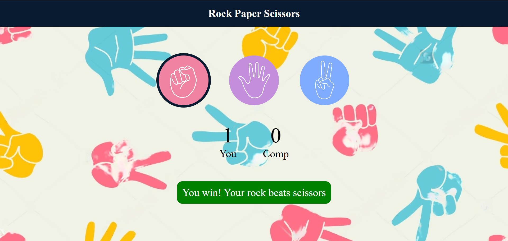

🪨 Rock Paper Scissors ✂️

Welcome to Rock Paper Scissors, the timeless hand game now brought to life on your browser!
Challenge yourself or your friends in this interactive, visually stunning, and responsive web-based game.


🎮 Features

- Simple Gameplay: Select rock, paper, or scissors and let the computer choose its move.

- Responsive Design: Fully compatible with mobile, tablet, and desktop screens.

- Dynamic Feedback: Real-time results with animations and a scoreboard.

- Play Again Button: Quick and seamless replay experience.
  

💻 Technologies Used

- HTML5: For structuring the game interface.
  
- CSS3: To style the game with animations and responsiveness.
  
- JavaScript: For dynamic interactivity and game logic.
  
🛠️ Setup and Usage

Clone this repository:
```bash```
```https://github.com/pragti-124/Rock-Paper-Scissors.git```

Navigate to the project directory:

```bash```
```cd Rock-Paper-Scissors```

Open index.html in your favorite browser.


🎨 Visuals
- Gameplay UI
- A sleek and minimalistic design.
- sound effects for better engagement.
  

🧩 How to Play
Select one of the three moves:
- 🪨 Rock
- 📄 Paper
- ✂️ Scissors
  
The computer will randomly choose its move.
The winner is decided based on these rules:

- Rock beats Scissors
  
- Scissors beats Paper
  
- Paper beats Rock
  
💡 Inspiration
Inspired by the classic hand game, reimagined for modern browsers. Perfect for quick fun or nostalgic moments.

🤝 Contribution
Feel free to fork this project and submit a pull request with your improvements!

📜 License
This project is licensed under the MIT License.


